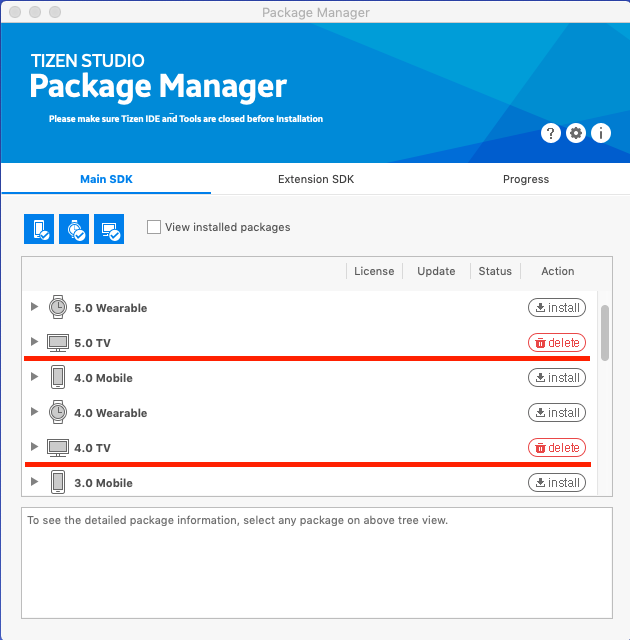
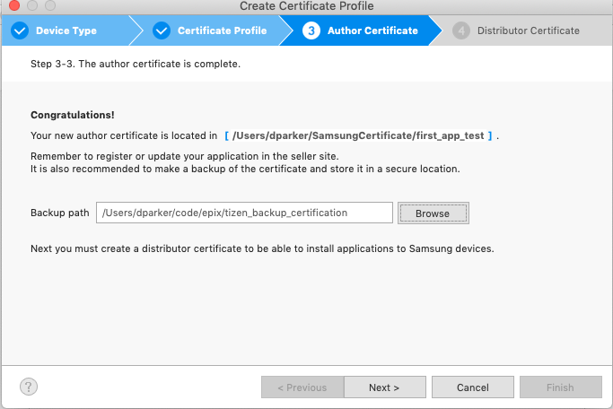
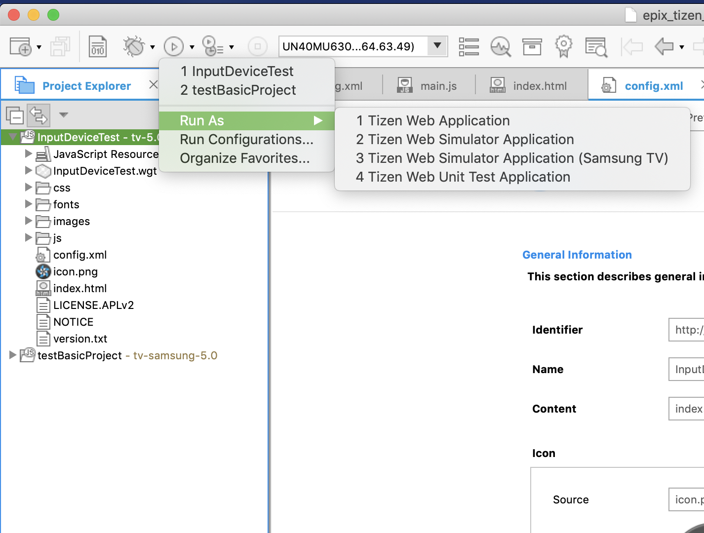
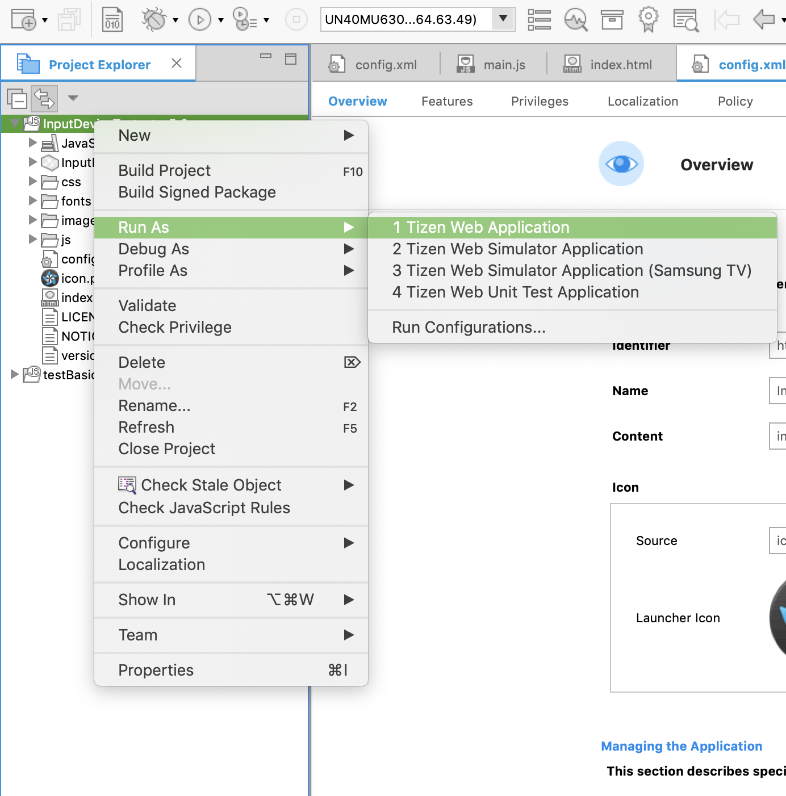

# Samsung Smart TV Tizen Spike
#### tags: #Work/stonehenge/samsung

## Important Documentation/Links for Development
- - - -
[Samsung Developer Home Page](https://developer.samsung.com)
[Samsung Smart TV Page](https://developer.samsung.com/tv)
[Samsung Smart TV Specification](https://developer.samsung.com/tv/develop/specifications/general-specifications)
[Samsung Smart TV  - Web Engine Specification](https://developer.samsung.com/tv/develop/specifications/web-engine-specifications)
[Samsung Smart TV  - TV Model Groups](https://developer.samsung.com/tv/develop/specifications/tv-model-groups)
[Samsung Smart TV - Product API Ref](https://developer.samsung.com/tv/develop/api-references/samsung-product-api-references/)
[Samsung W3C/HTML5 API Ref](https://developer.samsung.com/tv/develop/api-references/w3chtml5-api-references)
[Samsung Smart TV - Example (Media)](https://developer.samsung.com/tv/develop/samples/media)
[Samsung Smart TV - Legacy Platform](https://developer.samsung.com/tv/develop/samsung-legacy-platform)
[What year is my Samsung TV?](https://www.samsung.com/uk/support/tv-audio-video/what-do-samsung-tv-model-numbers-actually-mean-why-are-they-so-long/)
[Introduction to Web Applications | Tizen Developers](https://developer.tizen.org/development/training/web-application)
[Tizen CLI Commands](https://developer.tizen.org/ko/development/tizen-studio/web-tools/cli?langredirect=1)
[SDB - Smart Development Bridge CLI](https://developer.tizen.org/ko/development/tizen-studio/web-tools/running-and-testing-your-app/sdb?langredirect=1)
[Tizen Web Device API Ref](https://developer.tizen.org/ko/development/api-references/web-application?redirect=https://developer.tizen.org/dev-guide/5.0.0/org.tizen.web.apireference/html/w3c_api/w3c_api_tv.html#media)

### Additional Resources
- - - -
[Ultimate Guide to Samsung Tizen TV development](https://medium.com/norigintech/the-ultimate-guide-to-samsung-tizen-tv-web-development-f4613f672368)
[Simple Samsung TV + React Router](https://medium.com/yellowme/samsung-tv-react-react-router-tutorial-61452b7a9206)
[Samsung Examples - Video](https://developer.samsung.com/tv/develop/samples/media)
[Samsung Example - Voice/Media Controls](https://github.com/SamsungDForum/voice-mediacontrols/tree/master/modules/video)
[Samsung Example - HTML5 Player](https://github.com/SamsungDForum/PlayerHTML5)
[How to clock the screensaver during video playback](https://developer.samsung.com/tv/develop/legacy-platform-library/tec00115/index)
[Tizen Hints, Tips, & Tricks](https://developer.youi.tv/5.0/Content/Tizen_DevTopics/H1TizenHintsTipsTricks.htm)
[Youi.TV docs - Tizen](https://developer.youi.tv/5.1/Content/Tizen_Intro/H1TizenIntro.htm) - Not everything is relatable since we’re not using the Youi.TV engine; however, it’s good documentation.

**Samsung Account Login**
Username: epixdevqa@gmail.com
Password: epixqa260

### General questions I want to figure out
- - - -
1. How do I use [WIT](https://developer.samsung.com/tv/develop/extension-libraries/wits/)
2. How do I use [TOAST](https://developer.samsung.com/tv/develop/extension-libraries/toast/) - **it’s a plugin that you us in a Cordova app.**
3. What’s the difference between TV 4.0 & 5.0
 ::4.0 is 2018 Models - 5.0 is 2019 Models::
 
4. Should we use a **Cordova wrapper (preferred)** or another solution?  **If there is a demand to support legacy devices (TV < 2015) then I would suggest using “Toast”, which is a plugin for Cordova. Outside of that it's easiest to just make the web**
5. Find solution that works with web-kit / chromium (for TV's < 2015)  - **TOAST w/ Cordova**
6. Aria support (text to speech) - **There is an API for this**
7. Speech-to-text-support - **There is an API for this**
8. What would a non-hosted solution be? **This is the least friendly way to do development, but if you move a build over to the Tizen Project and correct the file paths it works, with privileges.**

## Getting Started
### Installation process
- - - -
1. Download [Tizen Studio](https://developer.samsung.com/tv/develop/tools)  **::for 2015 - 2019 Models::**
2. Follow [Installation Guide](https://developer.samsung.com/tv/develop/getting-started/setting-up-sdk/installing-tv-sdk/)
3. The **Package Manager** should open automatically. Inside the**Package Manager > Main SDK** you’ll want to install ::**5.0 & 4.0 TV**:: SDK’s

4. Inside the**Package Manager > Extension SDK** you’ll want to install
	1. ::TV Extensions-5.0::
	2. ::Samsung Certificate Extension::
	3. ::TV Extensions Tools::

### First (basic) TV Application
- - - -
1. Follow [Creating TV Applications](https://developer.samsung.com/tv/develop/getting-started/creating-tv-applications)
2. Using a **Sample** application lets you see how things are set up, **Template** will be what we ultimately want.
3. Once you’ve create a project you’ll want to follow [Using SDK > TV Device](https://developer.samsung.com/tv/develop/getting-started/using-sdk/tv-device) to run your application on the actual device.
::**PREREQUISITES** - TV has latest firmware, TV & Computer on same network, and [create certificate profile](https://developer.samsung.com/tv/develop/getting-started/setting-up-sdk/creating-certificates/)::

It will give you a _Certificate location_ & you’ll provide a _Backup Path_
This is **VERY** important when you get to the actually pushing to the store, but for development and playing around you can just delete them and create no problem.

1. Distributor Certificate you’ll need the Device Unique ID (DUID), which can be found in your TV **Settings > Support > About This TV**

### Connecting Computer to Samsung TV
::This is best done with an ethernet connection::
- - - -
1. Put the target TV in “Developer Mode” [Connecting the TV & SDK](https://developer.samsung.com/tv/develop/getting-started/using-sdk/tv-device)
Essentially go to the “Apps” page and using the remote enter “1, 2, 3, 4, 5”  and enter in your computer’s IP address ::Make sure you’re on the same network::
2. Using the Device Manager that comes with Tizen IDE you should be able to toggle the connection. Although, it’s pretty consistent if you run into issues using `sdb` [Smart developer bridge](https://developer.tizen.org/ko/development/tizen-studio/web-tools/running-and-testing-your-app/sdb?langredirect=1), which is a tool that comes with the installation of Tizen you can run the command `sdb connect <target-IP>` and being able to see currently connected devices `sdb devices`
3. To run the project most documentation shows using the top “Play” icon,

which I personally ended up getting an error stating “Closed”. To get around this there are two options.
	**3.1 -** If you `right-click` the project in the Explorer view and select **Run As > 1. Tizen Web Application** even though this seems to be the same as above, it for whatever reason works.

	**3.2 -** You can use the `tizen cli` tool by running the command `tizen install -n <project-build-file>.wgt`  to get a `*.wgt` file, which is an extension that represents a “widget” (Tizens way of `zipping` up a build version of the `web-app`). Tizen’s IDE crashes when it has to build anything that’s bigger than their example projects, so I installed the `VSCode` [tizen extension](https://marketplace.visualstudio.com/items?itemName=tizensdk.tizentv), which has commands to build the project that goes way faster. `cmd + shift + p` & `Tizen Build Package`

